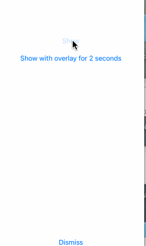

## GifHUD ##


**界面预览：**

----------




**使用方法**


```objc 
//Setup GiFHUD image
[GiFHUD setGifWithImageName:@"2.gif"];

 [GiFHUD show];


/// automatic dismiss

[GiFHUD showWithOverlay];

// dismiss after 2 seconds
dispatch_time_t popTime = dispatch_time(DISPATCH_TIME_NOW, 2 * NSEC_PER_SEC);
dispatch_after(popTime, dispatch_get_main_queue(), ^(void){
[GiFHUD dismiss];
});

dismiss
///
 [GiFHUD dismiss];

```


